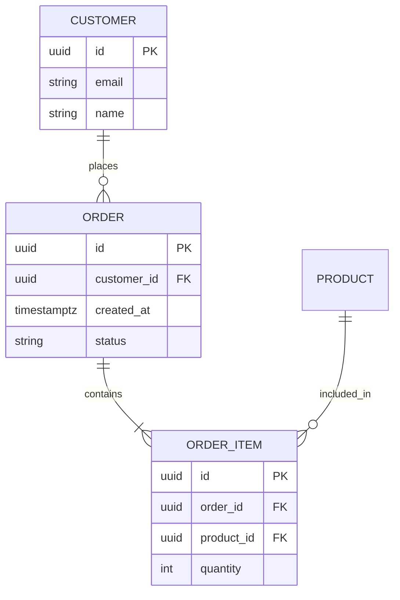

# Data Architecture Framework

**Purpose:** Centralized documentation for data models, schemas, relationships, and data governance patterns.

**When to use:** When designing entities, documenting database schemas, planning migrations, or establishing data quality standards.

---

## 📁 Directory Structure

```
data-architecture/
├── schema/
│   ├── entities/           # Individual entity/table definitions
│   ├── relationships/      # Entity relationships and ER diagrams
│   └── migrations/         # Schema migration history and patterns
├── data-governance/
│   ├── access-control/     # RLS policies, permissions, data access patterns
│   ├── audit-trails/       # Change tracking requirements
│   └── data-quality/       # Validation rules, constraints, data standards
└── examples/               # Example entity models and patterns
```

---

## 🎯 What to Document Here

### Schema Documentation (`schema/`)

#### Entities (`schema/entities/`)
Document each major entity/table in your system:

**File naming:** `{entity-name}.md` (e.g., `user.md`, `order.md`, `inventory-item.md`)

**Template structure:**
```markdown
# Entity Name

## Overview
Brief description of the entity and its purpose.

## Schema Definition
| Column | Type | Nullable | Default | Description |
|--------|------|----------|---------|-------------|
| id | uuid | NO | gen_random_uuid() | Primary key |
| created_at | timestamptz | NO | now() | Record creation timestamp |

## Relationships
- **Belongs to:** Parent entity (foreign key: parent_id)
- **Has many:** Child entities
- **Many-to-many:** Related entities (through join table)

## Indexes
- PRIMARY KEY (id)
- INDEX idx_created_at (created_at DESC)
- UNIQUE INDEX uniq_email (email)

## Business Rules
- Email must be unique and valid format
- Soft delete using deleted_at timestamp
- Audit all changes to audit_log table

## Access Control
- Row-level security enabled
- Users can only access their own records
- Admins have full access

## Migration History
- v1.0.0: Initial schema
- v1.1.0: Added email_verified column
- v1.2.0: Added indexes for performance
```

#### Relationships (`schema/relationships/`)
Document how entities relate to each other:

**File naming:** `{domain-area}-relationships.md` (e.g., `user-relationships.md`, `order-fulfillment-relationships.md`)

**What to include:**
- Entity relationship diagrams (ERD) using Mermaid
- Foreign key relationships
- Join table patterns for many-to-many
- Cascade delete/update rules
- Referential integrity constraints

**Example ERD:**


#### Migrations (`schema/migrations/`)
Track schema evolution over time:

**File naming:** `YYYYMMDD-description.md` (e.g., `20251014-add-email-verification.md`)

**Template structure:**
```markdown
# Migration: Add Email Verification

**Date:** 2025-10-14
**Version:** v1.1.0
**Status:** Applied / Pending / Rolled Back

## Purpose
Brief description of why this migration is needed.

## Changes
### Tables Modified
- `users`: Added `email_verified` boolean column

### SQL Up Migration
\`\`\`sql
ALTER TABLE users ADD COLUMN email_verified BOOLEAN DEFAULT FALSE NOT NULL;
CREATE INDEX idx_users_email_verified ON users(email_verified) WHERE email_verified = FALSE;
\`\`\`

### SQL Down Migration (Rollback)
\`\`\`sql
DROP INDEX IF EXISTS idx_users_email_verified;
ALTER TABLE users DROP COLUMN IF EXISTS email_verified;
\`\`\`

## Impact Analysis
- **Breaking Changes:** None
- **Data Migration Required:** No (default value provided)
- **Downtime Required:** No (can apply online)
- **Performance Impact:** Minimal (small column addition)

## Testing Checklist
- [ ] Migration applied successfully in development
- [ ] Migration applied successfully in staging
- [ ] Rollback tested in development
- [ ] Data integrity verified after migration
- [ ] Performance impact measured

## Rollback Procedure
1. Run down migration SQL
2. Verify data integrity
3. Update application code to remove email verification logic
```

---

### Data Governance (`data-governance/`)

#### Access Control (`data-governance/access-control/`)
Document data access patterns and security policies:

**Example files:**
- `rls-policies.md` - Row-level security policies
- `rbac-data-access.md` - Role-based data access rules
- `data-classification.md` - PII, sensitive, public data classification

**Template:**
```markdown
# Row-Level Security Policies

## Users Table RLS
### Policy: users_select_own
**Type:** SELECT
**Role:** authenticated
**Condition:** `auth.uid() = id`
**Description:** Users can only view their own user record

### Policy: users_update_own
**Type:** UPDATE
**Role:** authenticated
**Condition:** `auth.uid() = id`
**Description:** Users can only update their own user record

### Policy: users_admin_all
**Type:** ALL
**Role:** service_role
**Condition:** `true`
**Description:** Service role (admin) has full access
```

#### Audit Trails (`data-governance/audit-trails/`)
Document what changes need to be tracked:

**Example files:**
- `audit-requirements.md` - What to audit and why
- `audit-schema.md` - Audit log table schema
- `audit-triggers.md` - Database triggers for automatic auditing

#### Data Quality (`data-governance/data-quality/`)
Document validation rules and data standards:

**Example files:**
- `validation-rules.md` - Field-level validation requirements
- `data-standards.md` - Naming conventions, format standards
- `data-cleanup.md` - Data quality maintenance procedures

---

## 🎓 Best Practices

### 1. Entity Documentation
- **Document immediately** when creating new entities
- **Update on schema changes** to keep documentation in sync
- **Include examples** of valid and invalid data
- **Link to business requirements** in memory-bank

### 2. Relationship Clarity
- **Use visual diagrams** for complex relationships
- **Document cascade rules** explicitly
- **Explain business rationale** for relationships
- **Keep ERDs up to date** with schema changes

### 3. Migration Discipline
- **Always provide rollback** for every migration
- **Test migrations** in development first
- **Document breaking changes** clearly
- **Track migration dependencies** (order matters)

### 4. Data Governance
- **Security by default** - assume least privilege
- **Audit sensitive operations** - track who did what when
- **Validate at multiple layers** - database + application + UI
- **Classify data sensitivity** - know what's PII and what's not

---

## 🔄 Related Documentation

### Memory-Bank References
- `memory-bank/features/*/technical-design.md` - Feature-specific data models
- `memory-bank/security-compliance/` - Security and compliance requirements
- `memory-bank/testing-qa/test-data/` - Test data generation based on schemas

### External Resources
- [PostgreSQL Documentation](https://www.postgresql.org/docs/)
- [Supabase Database Guide](https://supabase.com/docs/guides/database)
- [Data Modeling Best Practices](https://www.postgresql.org/docs/current/ddl.html)

---

## 📋 Quick Start Checklist

### When Creating a New Entity
- [ ] Document entity in `schema/entities/{entity-name}.md`
- [ ] Create migration file in `schema/migrations/YYYYMMDD-add-{entity}.md`
- [ ] Add relationships to relevant `schema/relationships/*.md` file
- [ ] Define RLS policies in `data-governance/access-control/rls-policies.md`
- [ ] Add audit requirements if sensitive data in `data-governance/audit-trails/`
- [ ] Document validation rules in `data-governance/data-quality/validation-rules.md`
- [ ] Update examples in `examples/` directory
- [ ] Cross-reference in relevant feature documentation

---

**Last Updated:** 2025-10-14
**Maintainer:** Development Team
**Review Frequency:** Monthly (or on schema changes)
